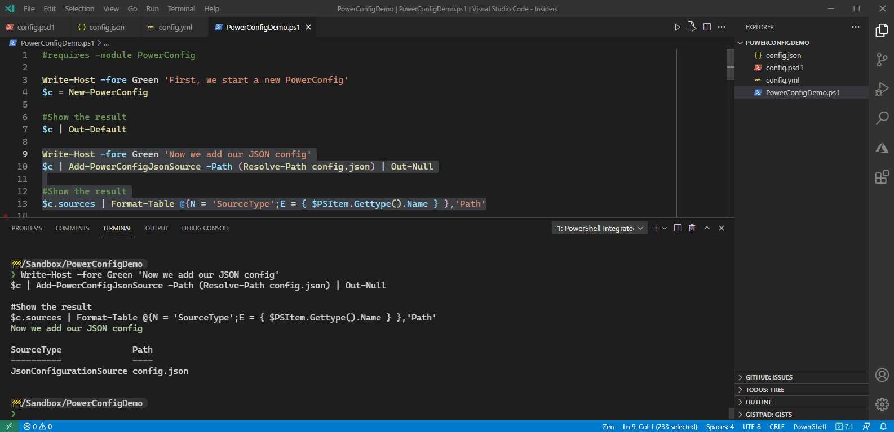
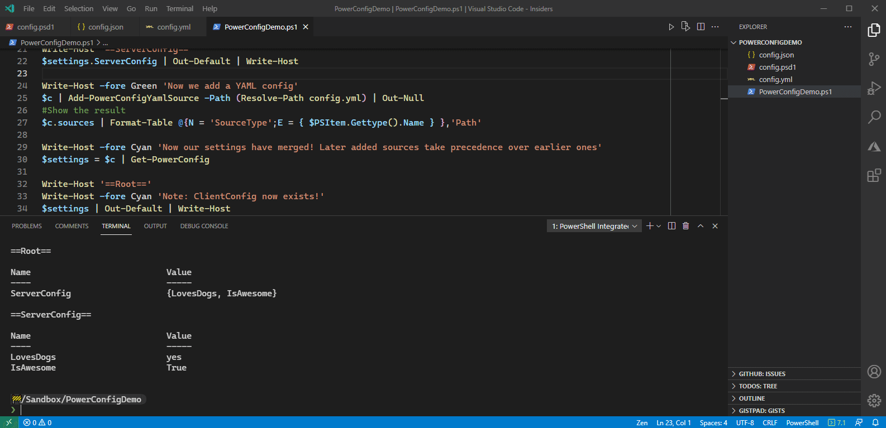
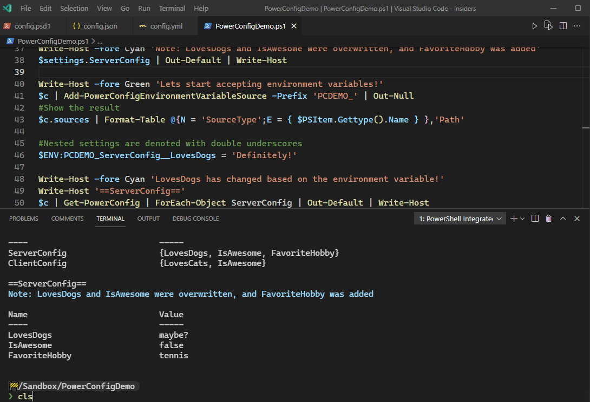
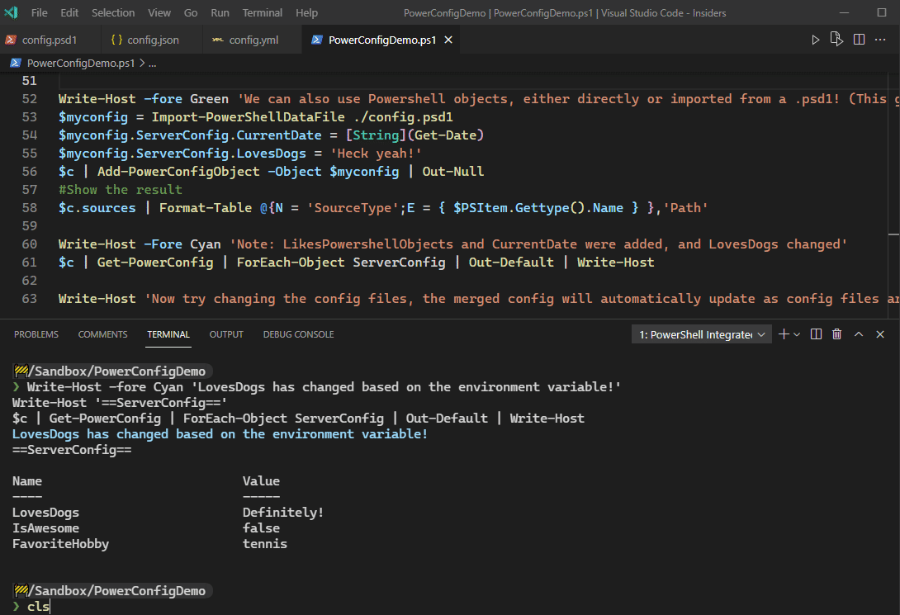

# PowerConfig
Configure your Script or Module with an overlaying config engine. Uses Microsoft.Extensions.Configuration as a backend.

Users can configure your module or script from a variety of sources: multiple json files, yaml files, command line parameters, environment variables, etc. and this gives you a simple unified and merged key-value pair table for all of those configuration points.

If you have ever used ASP.NET configuration this will seem very familiar because it is the same engine :)

# Demo
Check out [the demo script](./Demo)

## Setup and Json Config Source

## YAML Config Source

## Environment Config Source

## Powershell Objects and .psd1 files as Config Source

## Realtime Info Updates
